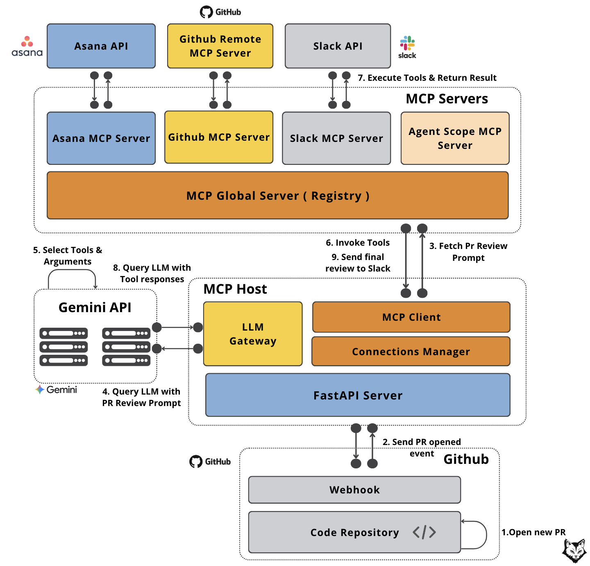

# my-pr-reviewer

An enterprise-grade PR reviewer built on MCP (Model Context Protocol),
following the "why MCP breaks old enterprise AI" architecture: a clean
separation between the **host** (orchestrator + LLM) and **servers**
(tool integrations), connected through a single aggregating registry.

## Architecture
GitHub PR opened
|
v
FastAPI webhook (host)
|
v
MCP Host (Connections Manager + MCP Client + LLM Gateway)
|
v
Registry Server (one MCP connection, proxies everything below)
|
+-- Agent Scope Server (PR review prompt template)
+-- Asana Server (fetch linked task details)
+-- GitHub (remote) (GitHub's own hosted MCP server)
+-- Slack Server (post the review to a channel)


The host never talks to Asana, Slack, or GitHub directly - it only
knows how to talk to the registry, and the registry knows how to talk
to everything else. Swap Asana for Jira, or Gemini for Claude, and
only one file changes.

## Repo structure

apps/
pr-reviewer-mcp-host/ # orchestrator: webhook, LLM, MCP client
src/pr_reviewer_mcp_host/
api/webhook.py # receives GitHub's PR-opened event
host/
connection_manager.py # spawns + connects to registry_server.py
mcp_client.py # clean invoke_tool/get_prompt interface
llm_gateway.py # talks to Gemini
main.py # FastAPI app entrypoint

pr-reviewer-mcp-servers/ # tool integrations
src/pr_reviewer_mcp_servers/
servers/
agent_scope_server.py # PR review prompt (MCP prompt)
asana_server.py # fetch Asana task (MCP tool)
github_server.py # connects to GitHub's remote MCP server
slack_server.py # post to Slack (MCP tool)
slack_oauth_install.py # one-time OAuth flow for Slack token
clients/ # thin REST wrappers (Asana, Slack)
registry/
mcp_global_server.py # MCPRegistry - aggregates all servers (client side)
registry_server.py # runs the above AS an MCP server (server side)


## Prerequisites

- [uv](https://docs.astral.sh/uv/) (Python package/venv manager)
- Python 3.10+ (uv installs this for you)
- Accounts + API access: Google AI Studio (Gemini), Asana, Slack, GitHub

## Setup

Both apps are independent `uv` projects with their own venv - set up
each one separately.

### 1. Servers app

```powershell
cd apps\pr-reviewer-mcp-servers
uv sync
```

Create `.env` (copy `.env.example` and fill in real values):

ASANA_ACCESS_TOKEN=... # https://app.asana.com/0/developer-console
GITHUB_PERSONAL_ACCESS_TOKEN=... # https://github.com/settings/tokens (repo scope)
SLACK_CLIENT_ID=... # https://api.slack.com/apps -> your app -> Basic Information
SLACK_CLIENT_SECRET=...
SLACK_BOT_TOKEN=... # obtained via the OAuth installer below, not typed by hand


Run the one-time Slack OAuth install (opens a browser, then prints a
bot token to paste into `.env`):

```powershell
uv run python src\pr_reviewer_mcp_servers\servers\slack_oauth_install.py
```

### 2. Host app

```powershell
cd ..\pr-reviewer-mcp-host
uv sync
```

Create `.env`:

GEMINI_API_KEY=... # https://aistudio.google.com/apikey
GITHUB_WEBHOOK_SECRET=... # any random string you invent
GITHUB_PERSONAL_ACCESS_TOKEN=... # same token as the servers app, used to fetch PR diffs
SLACK_REVIEW_CHANNEL=#all-mcp # optional, defaults to #all-mcp


## Running

Start the host (this is what receives GitHub's webhook and spawns the
registry + all backend servers as subprocesses on demand):

```powershell
cd apps\pr-reviewer-mcp-host
uv run python src\pr_reviewer_mcp_host\main.py
```

Confirm it's up:

```powershell
curl http://localhost:8000/health
```

To receive real GitHub webhooks, this needs to be reachable from the
public internet - see the ngrok setup section (or your deployment
platform of choice) for exposing `localhost:8000` publicly.

## Status

- [x] All four MCP servers built and individually tested
- [x] Registry aggregates all servers behind one connection
- [x] Host connects through the registry, invokes tools and prompts
- [x] Webhook verifies GitHub's signature and triggers a review
- [x] Review pipeline: fetch diff -> render prompt -> ask Gemini -> post to Slack
- [x] Live end-to-end test against a real GitHub PR, via ngrok
- [ ] Full agentic tool-calling loop (LLM dynamically choosing which
      tools to call, rather than a fixed diff -> review -> post pipeline)
- [ ] Permanent public URL (ngrok free tier URL changes on every
      restart, requiring the GitHub webhook URL to be updated each time)

## Testing with a real GitHub PR (via ngrok)

1. Install ngrok, sign up at https://dashboard.ngrok.com, and run
   ngrok config add-authtoken YOUR_TOKEN.
2. Start the host: uv run python src\pr_reviewer_mcp_host\main.py
3. In a second terminal: ngrok http 8000 - copy the https://...ngrok-free.dev URL it prints.
4. On GitHub: repo -> Settings -> Webhooks -> Add webhook.
   - Payload URL: <ngrok URL>/webhook/github
   - Content type: application/json
   - Secret: must exactly match GITHUB_WEBHOOK_SECRET in the host's .env
   - Events: select only "Pull requests"
5. Open a real PR against the repo. Check the host's terminal for a
   200 OK log line, then check your configured Slack channel for the
   posted review.

Note: ngrok's free tier assigns a new random URL every time you
restart it - update the webhook's Payload URL on GitHub to match
whenever that happens.